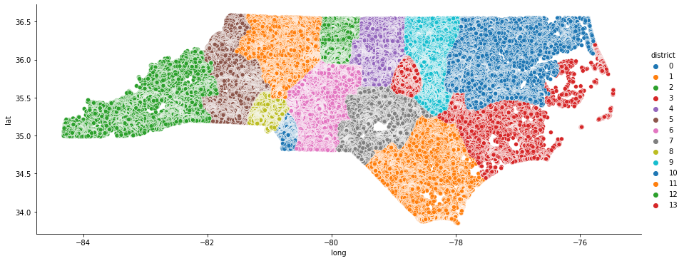
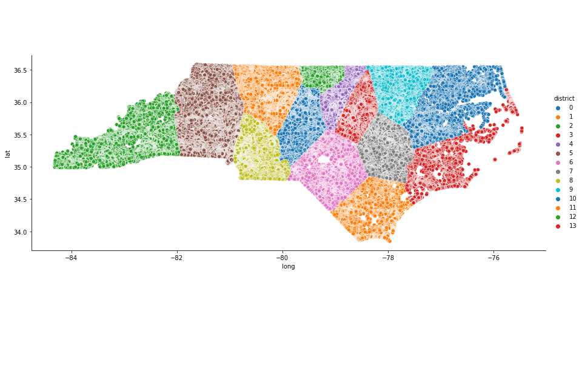

# redistricting
cs333

Final Project: Redistricting Algorithms

- Our primary algorithm resides in k-means.py 

NC Map alpha = 7, beta = 0.92, gamma = 2:

As the k-means process optimizes the clusters

